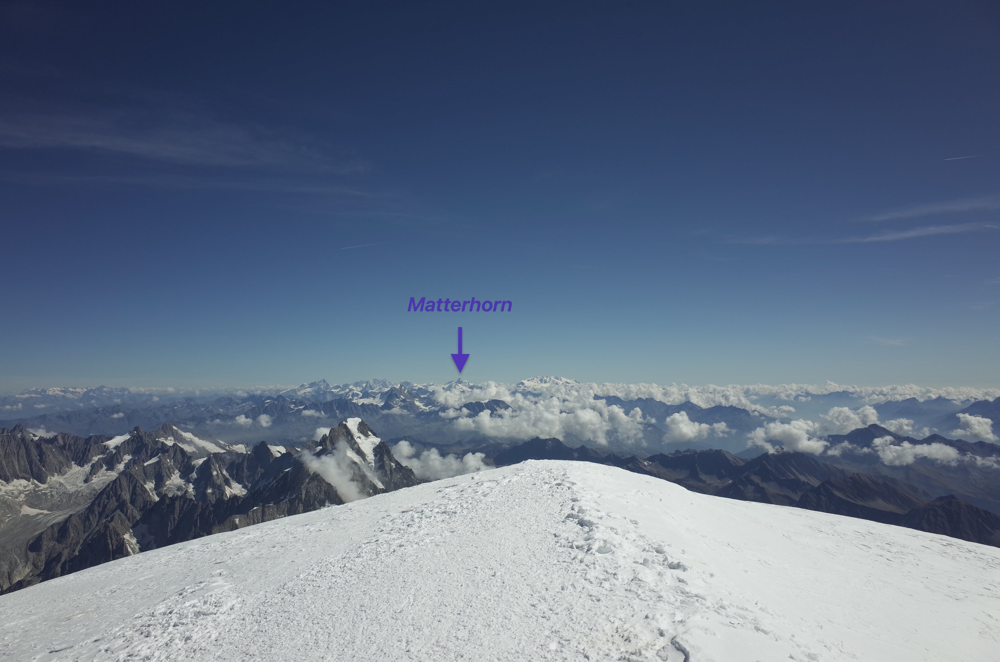
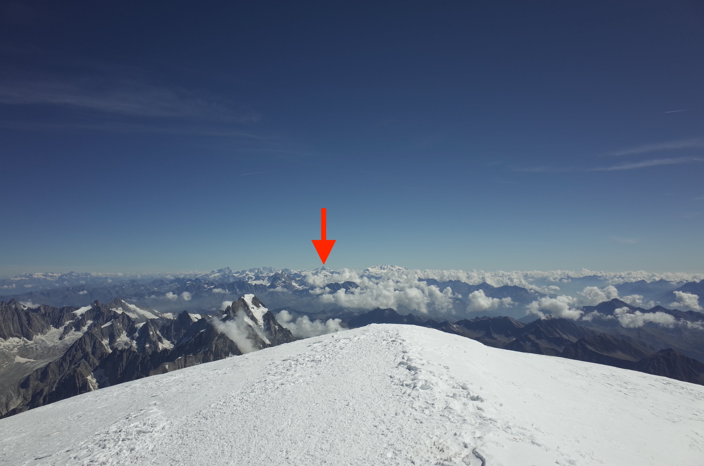

<h1><small>About me</small></h1>



---

Hi, I'm Hiroki Nagasawa, also known as @{{ site.author }}, and an iOS software engineer at [Doist](https://doist.com). I built [my apps](/apps) for the iPhone, iPad, and Mac.

Apart from software development and programming, I'm passionate about trekking, climbing, playing soccer, and stargazing with binoculars.
All views on this website are mine.

You can reach me via <a href="{{ site.links.email }}"><em>this email</em></a> (created by Apple's Hide My Email) and find me on:



---

The view from the top of Mont Blanc where you can see tiny but sharp Matterhorn. Here is a quiz for you. Which one is Matterhorn?

Answer

