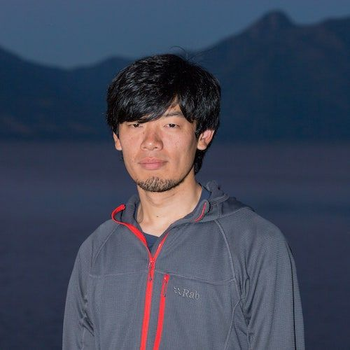
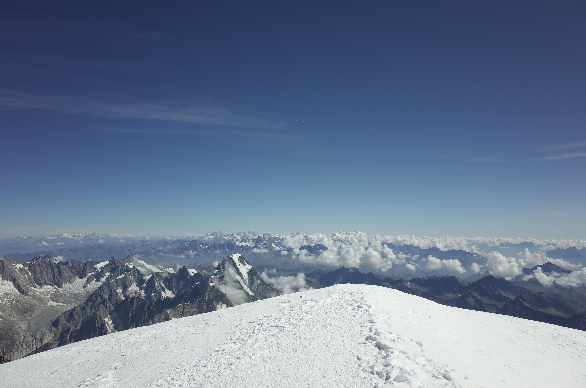

    

## Hiroki Nagasawa

I'm an iOS software engineer at [Doist](https://doist.com), working on [Todoist](https://todoist.com/home) and [Twist](https://twist.com/home). As a side project, I have made [apps](/apps) for Apple platforms.

Apart from software development and programming, I'm passionate about trekking, climbing, and stargazing. All views on this website are mine.

You can reach me via <a href="{{ site.links.email }}"><em>hi[at]pixyzehn.com</em></a> and find me on:



More about me:
- [Interviewed by ROKKONOMAD](https://rokkonomad.org/news_column/3080) (Japanese)
- [Interviewed by NL/ROKKO RADIO](https://open.spotify.com/episode/377Au7Rh7DPtRtN0RFOA7P) (Podcast, Japanese)
- [Interviewed by Remote Work Labo](https://www.remotework-labo.jp/2018/10/doist01/) (Japanese)

<i><small>The view from the top of Mont Blanc where you can see tiny but sharp Matterhorn.</small></i>

