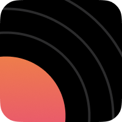
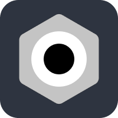
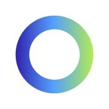
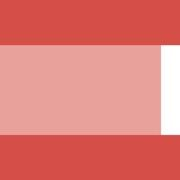
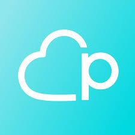
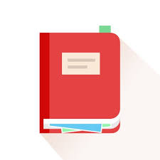

<h1><small>Apps</small></h1>

    
    <h2>Expenses</h2>
    

        Free
        In-App Purchases
        Universal App
    

    
Expenses has been crafted to keep track of your spending effortlessly, with useful features in a simple, intuitive interface.

    
<a href="{{ site.links.expenses }}" target="_blank">Learn More <svg xmlns="http://www.w3.org/2000/svg" width="16" height="16" fill="currentColor" class="bi bi-arrow-up-right-square" viewBox="0 0 16 16">
  <path fill-rule="evenodd" d="M15 2a1 1 0 0 0-1-1H2a1 1 0 0 0-1 1v12a1 1 0 0 0 1 1h12a1 1 0 0 0 1-1V2zM0 2a2 2 0 0 1 2-2h12a2 2 0 0 1 2 2v12a2 2 0 0 1-2 2H2a2 2 0 0 1-2-2V2zm5.854 8.803a.5.5 0 1 1-.708-.707L9.243 6H6.475a.5.5 0 1 1 0-1h3.975a.5.5 0 0 1 .5.5v3.975a.5.5 0 1 1-1 0V6.707l-4.096 4.096z"/>
</svg></a>

    
<i>Released on May 14, 2020</i>

    
    <h2>Rerere</h2>
    

        Free
        In-App Purchases
        Universal App
    

    
A simple process-oriented checklist app that helps you ensure you don't forget anything.

    
<a href="/rerere/">Learn More <svg xmlns="http://www.w3.org/2000/svg" width="16" height="16" fill="currentColor" class="bi bi-chevron-right" viewBox="0 0 16 16">
  <path fill-rule="evenodd" d="M4.646 1.646a.5.5 0 0 1 .708 0l6 6a.5.5 0 0 1 0 .708l-6 6a.5.5 0 0 1-.708-.708L10.293 8 4.646 2.354a.5.5 0 0 1 0-.708z"/>
</svg></a>

    
<i>Released on May 14, 2022</i>

    
    <h2>8Planets</h2>
    

        Paid
        iOS & watchOS
        
        macOS
    

    
8Planets is a simple viewer and simulator for planetary orbits in our Solar System.

    
<a href="{{ site.links.eightplanets }}" target="_blank">Learn More <svg xmlns="http://www.w3.org/2000/svg" width="16" height="16" fill="currentColor" class="bi bi-arrow-up-right-square" viewBox="0 0 16 16">
  <path fill-rule="evenodd" d="M15 2a1 1 0 0 0-1-1H2a1 1 0 0 0-1 1v12a1 1 0 0 0 1 1h12a1 1 0 0 0 1-1V2zM0 2a2 2 0 0 1 2-2h12a2 2 0 0 1 2 2v12a2 2 0 0 1-2 2H2a2 2 0 0 1-2-2V2zm5.854 8.803a.5.5 0 1 1-.708-.707L9.243 6H6.475a.5.5 0 1 1 0-1h3.975a.5.5 0 0 1 .5.5v3.975a.5.5 0 1 1-1 0V6.707l-4.096 4.096z"/>
</svg></a>

    
<i>Released on March 22, 2021</i>

    
    <h2>PasswordGen</h2>
    

        Paid
        Universal App
    

    
PasswordGen is a tiny app that will allow you to create a strong password quickly and easily.

    
<a href="/passwordgen/">Learn More <svg xmlns="http://www.w3.org/2000/svg" width="16" height="16" fill="currentColor" class="bi bi-chevron-right" viewBox="0 0 16 16">
  <path fill-rule="evenodd" d="M4.646 1.646a.5.5 0 0 1 .708 0l6 6a.5.5 0 0 1 0 .708l-6 6a.5.5 0 0 1-.708-.708L10.293 8 4.646 2.354a.5.5 0 0 1 0-.708z"/>
</svg></a>

    
<i>Released on December 11, 2021</i>

    
    <h2>Rokuyo</h2>
    

        Free
        macOS
    

    
Rokuyo is a simple menu bar app that will let you know about today's Rokuyo (六曜).

    
<a href="/rokuyo/">Learn More <svg xmlns="http://www.w3.org/2000/svg" width="16" height="16" fill="currentColor" class="bi bi-chevron-right" viewBox="0 0 16 16">
  <path fill-rule="evenodd" d="M4.646 1.646a.5.5 0 0 1 .708 0l6 6a.5.5 0 0 1 0 .708l-6 6a.5.5 0 0 1-.708-.708L10.293 8 4.646 2.354a.5.5 0 0 1 0-.708z"/>
</svg></a>

    
<i>Released on October 14, 2021</i>

Apps I used to build

    
    
    
    
    
    
    

Apps I used to work for at my prev job

    
    
    
    
    

