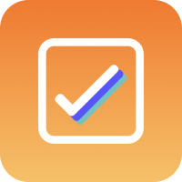

<h1><small>Apps</small></h1>

    
    <h2>Expenses</h2>
    

        Free
        In-App Purchases
        Universal App
    

    
Expenses has been crafted to keep track of your spending effortlessly, with useful features in a simple, intuitive interface.

    
<a href="{{ site.links.expenses }}" target="_blank">Learn More <i class="bi bi-arrow-up-right-square"></i></a>

    
<i>Released on May 14, 2020</i>

    
    <h2>Rerere</h2>
    

        Free
        In-App Purchases
        Universal App
    

    
A simple process-oriented checklist app that helps you ensure you don't forget anything.

    
<a href="/rerere/">Learn More <i class="bi bi-chevron-right"></i></a>

    
<i>Released on May 14, 2022</i>

    
    <h2>8Planets</h2>
    

        Paid
        iOS & watchOS
        
        macOS
    

    
8Planets is a simple viewer and simulator for planetary orbits in our Solar System.

    
<a href="{{ site.links.eightplanets }}" target="_blank">Learn More <i class="bi bi-arrow-up-right-square"></i></a>

    
<i>Released on March 22, 2021</i>

    
    <h2>PasswordGen</h2>
    

        Paid
        Universal App
    

    
PasswordGen is a tiny app that will allow you to create a strong password quickly and easily.

    
<a href="/passwordgen/">Learn More <i class="bi bi-chevron-right"></i></a>

    
<i>Released on December 11, 2021</i>

    
    <h2>Rokuyo</h2>
    

        Free
        macOS
    

    
Rokuyo is a simple menu bar app that will let you know about today's Rokuyo (六曜).

    
<a href="/rokuyo/">Learn More <i class="bi bi-chevron-right"></i></a>

    
<i>Released on October 14, 2021</i>

Archived Apps

    
    
    
    
    
    
    

