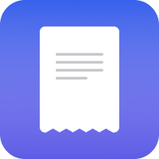

<h1><small>My Apps</small></h1>

 

    
    <h2>Expenses FREE </h2>
    
Expenses has been crafted to keep track of your spending effortlessly, with useful features in a simple, intuitive interface. And with iCloud, it’s easy to keep all your expenses in sync across your devices and collaborate with others using sharing. The apps are available on Mac, iPhone, and iPad.

    
<a href="{{ site.links.expenses }}" target="_blank">Learn More</a>

    
<a href="{{ site.links.expenses_twitter }}" target="_blank">@expensesapp on Twitter</a>

    
Released on May 14, 2020

    
    <h2>8Planets</h2>
    
8Planets is a simple viewer and simulator for planetary orbits in our Solar System. 8Planets helps you discover how the planets aligned and move around over time so that you feel the scale of the Solar System or even the Universe. By giving you quick and easy access to the Solar System everywhere, 8Planets will make you feel that the Solar System is close to us. The apps are available on Mac, iPhone, iPad, and Apple Watch.

    
<a href="{{ site.links.eightplanets }}" target="_blank">Learn More</a>

    
<a href="{{ site.links.eightplanets_twitter }}" target="_blank">@8planetsapp on Twitter</a>

    
Released on March 22, 2021

    
    <h2>Rokuyo FREE </h2>
    
Rokuyo is a simple menu bar app that will let you know about today's Rokuyo (六曜). Today's Rokuyo is always up to date based on your date and timezone. That's all. We hope you enjoy one of the interesting facts in Japanese culture. The app is available on Mac.

    
<a href="{{ site.links.rokuyo }}" target="_blank">Download on the Mac App Store</a>

    
<a href="{{ site.links.rokuyo_twitter }}" target="_blank">@rokuyoapp on Twitter</a>

    
Released on October 14, 2021

    
    <h2>PasswordGen</h2>
    
PasswordGen is a tiny menu bar app that will allow you to create a strong password quickly and easily. When you can't simply use a suggested password on Mac, the app will also help you overcome password restrictions without compromise, such as only specific symbols are allowed on a website. The app will be available on Mac.

    
Coming Soon

    
<a href="{{ site.links.passwordgen }}" target="_blank">Download Beta on the TestFlight for Mac</a>

    
<a href="{{ site.links.passwordgen_twitter }}" target="_blank">@passwordgenapp on Twitter</a>

Archived Apps

    
    
    
    
    
    
    

