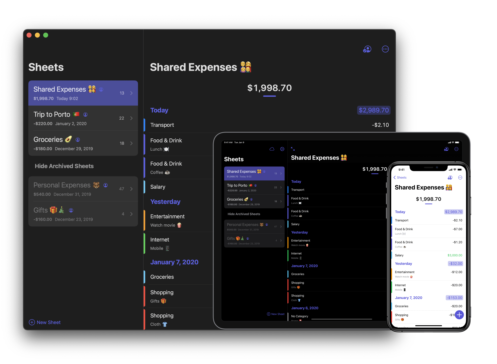

    
    <h1>Expenses</h1>
    
Expenses is the best place to keep track of your spending effortlessly, with useful features in a simple, intuitive interface. And with iCloud, it’s easy to keep all your expenses in sync across your devices and collaborate with others using sharing.
    
    

    

        

            <h2>Quick input</h2>
            
Enter your expense quickly and easily.

        

        

            <h2>Sharing</h2>
            
Collaborate with others to better organize your expenses.

        

    

    

        

            <h2>No registration</h2>
            
We care about your privacy seriously. Expenses requires no registration and no personal data.

        

        

            <h2>All currencies</h2>
            
Expenses supports all currencies when creating a sheet.

        

    

    

        

            <h2>Exporting</h2>
            
All data you enter are exportable.

        

        

            <h2>Statistics</h2>
            
The statistics show you an overview of your spending.

        

    

    

        

            <h2>Categories</h2>
            
You have full control of how you manage categories.

        

        

            <h2>Accessibility</h2>
            
Expenses provides extraordinary Accessibility support such as Voice Over, Dynamic Type, and so forth

        

    

    

        

            <h2>Others</h2>
            <li>Dark mode</li>
            <li>Support Split view
            <li>Multiple windows on iPad</li>
            <li>Option to use iCloud Sync</li>
            <li>Works offline</li>
            <li>Quick Actions</li>
            <li>Print a sheet</li>
            <li>Archive a sheet, etc</li>
        

    

